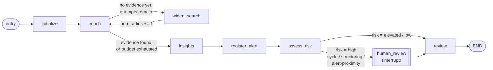

# AML Alert Triage Agent

This study project demonstrates a fictional AML customer-investigation workflow built with LangGraph, Neo4j, and DynamoDB. The repository includes a Docker Compose setup for running Neo4j and DynamoDB Local so the graph-backed workflow can be exercised without manual database installation.

## Local Setup

1. Copy `.env.example` to `.env` and adjust values if needed.
2. Start Neo4j and DynamoDB Local with Docker Compose:

```bash
docker compose up -d
```

3. Open Neo4j Browser at http://localhost:7474, and DynamoDB Admin at http://localhost:8001.
4. Use the credentials from `.env` to connect to Neo4j.

5. Verify application connectivity:

```bash
python -m aml_alert_triage.main --check-neo4j
python -m aml_alert_triage.main --check-dynamodb
```

6. Load fictional seed data (both the graph and the alert snapshot store):

```bash
python -m aml_alert_triage.main --seed-neo4j --seed-file data/neo4j/seed.cypher
python -m aml_alert_triage.main --seed-dynamodb --dynamodb-seed-file data/dynamodb/seed.json
```

## Running the Demo

The application code is organized under `src/aml_alert_triage/`. The triage workflow investigates a **customer** (not a pre-labeled alert) and decides for itself, from the graph evidence, whether an alert is warranted. Use `--customer-id` to pick who to investigate (see [Transaction Graph Model](#transaction-graph-model)) and `--use-langgraph` to run the compiled LangGraph graph instead of the plain linear call chain:

```bash
# Linear call chain (default), an ordinary organic customer
python -m aml_alert_triage.main --customer-id cust-101 --prompt "Review this customer and provide concise investigation insights."

# Compiled LangGraph graph, an undiscovered structuring fan-in case
python -m aml_alert_triage.main --use-langgraph --customer-id cust-214
```

## Triage Strategy Flow

Each investigation run follows a fixed sequence of stages, regardless of whether LLM insight generation is enabled:

1. **User prompt** - the caller supplies a customer id and an optional free-text prompt describing what they want the analyst summary to focus on.
2. **Neo4j retrieval** - the workflow queries Neo4j (or the bundled offline fixtures when no database is reachable) for graph evidence connected to the customer's accounts - transactions, structural patterns (cycles/structuring), and proximity to other already-alerted customers - plus any pre-existing alert for that customer, and produces a deterministic evidence summary.
3. **LLM insight generation** - the customer context, user prompt, and evidence are composed into a constrained prompt and sent to the configured insight adapter (deterministic rule-based, or a real LLM), which returns a short summary, key observations, and a grounded recommendation on whether to raise an alert. If the LLM is unavailable or returns an error, the workflow falls back to safe default insight text and records the failure instead of stopping the run.
4. **Alert registration** - if the customer already has an alert, it is reported unchanged. Otherwise, if insight generation recommended one, the workflow writes a new `Alert` node back to Neo4j (idempotent - a customer never ends up with two).
5. **Response output** - the workflow combines the evidence-backed recommendation with the LLM insights and alert outcome into one structured JSON response, clearly separating factual evidence statements from interpretive insights.

```
user prompt -> Neo4j retrieval -> LLM insight generation -> alert registration -> response output
```

## LangGraph Execution Graph

The workflow logic in `src/aml_alert_triage/workflow.py` is written as plain functions over an immutable `TriageState` dataclass, so it can run two ways: as a **linear** in-process call chain (`run_triage`, a bounded `while` loop plus a synchronous callback), or as a **compiled LangGraph `StateGraph`** (`build_langgraph`, with real conditional edges, a cycle, and a checkpointed interrupt). Both execute the same node logic and produce the same fields, but only the graph form can express branching, retries, and pausing natively:



| Node | Function | What it does |
| --- | --- | --- |
| `initialize` | `initialize_state` | Seeds `TriageState` from the customer id and user prompt. |
| `enrich` | `enrich_state` | Queries Neo4j at the current `hop_radius` for connected evidence, dedicated cycle/structuring/alert-proximity pattern matches, and any pre-existing alert for the customer. |
| `widen_search` | `widen_search` | **The graph's cycle.** Increments `hop_radius` when evidence so far is thinner than `min_evidence_for_conclusion` and the retry budget (`max_enrichment_attempts`, `NEO4J_MAX_HOPS`) allows another attempt, then routes back to `enrich`. Bounded, so it always terminates. |
| `insights` | `generate_insights` | Sends the settled evidence to the insight adapter for a summary, key observations, and an alert recommendation (see [LLM Insight Generation](#llm-insight-generation)). |
| `register_alert` | `register_alert` | **Writes back to Neo4j.** If the customer already has an alert, reports it unchanged. Otherwise, if insight generation recommended one, creates a new `Alert` node (idempotent) and persists an immutable evidence/insight snapshot to DynamoDB for later report generation. Independent of `assess_risk`'s structural classification - it reacts to the insight's own grounded judgment. |
| `assess_risk` | `assess_risk` | Classifies evidence into a risk level: `high` if a `cycle`/`structuring-fanout`/`structuring-fanin`/`alert-proximity` pattern was detected, `elevated` if any other evidence exists, `low` otherwise. |
| `human_review` | interrupts via `langgraph.types.interrupt` | **Only reached for `high` risk.** Pauses the graph - genuinely, via the compiled checkpointer - and waits for an analyst decision (`confirm-escalation` / `reject-escalation`) sent back with `Command(resume=...)`. |
| `review` | `review_evidence` + `finalize_state` | Produces the final recommendation and disposition (`escalate` / `review` / `monitor`), honoring any analyst decision. |

This is the part a plain function chain can't reproduce on its own: `enrich <-> widen_search` is a real cycle, the two `route_after_*` functions are conditional edges chosen from a live risk classification, and `human_review` genuinely suspends execution mid-graph (backed by `MemorySaver`) rather than blocking a thread or requiring a callback - `run_triage`'s linear equivalent has to fake the pause with a synchronous `human_review_callback` because a straight-line function chain has nothing to pause and resume.

### Human-in-the-loop review from the CLI

```bash
# 1. Run a high-risk scenario - it pauses and prints the interrupt payload
python -m aml_alert_triage.main --use-langgraph --customer-id cust-200 --thread-id demo-1

# 2. Resume with an analyst decision, in the same process
python -m aml_alert_triage.main --use-langgraph --customer-id cust-200 --thread-id demo-1 --analyst-decision confirm-escalation
```

`--analyst-decision` can also be passed on the very first call to pause and resume in one command (useful for scripting demos). The built-in `MemorySaver` checkpointer is in-memory only, so a paused run can only be resumed within the same process - persisting checkpoints across separate CLI invocations would need a durable backend such as `langgraph-checkpoint-sqlite`.

## Transaction Graph Model

The graph models a small fictional bank's money movement, not a set of pre-labeled test cases. `Customer` nodes `OWNS` one `Account`; accounts move money to each other over a single `TRANSFERRED_TO` relationship type, distinguished by a `channel` property - `pix`, `boleto`, `ted`, or `deposit` - matching how Brazilian retail payments actually happen day to day. `Alert` nodes are not an input - they are the workflow's **output**: `-[:TARGETS]->` a customer, created by `register_alert` when insight generation concludes a customer should be flagged. **Nothing in the graph states up front what AML typology, if any, a customer is actually involved in** - that is what the LangGraph workflow's cycle/structuring/proximity queries and the LLM insight stage exist to determine.

The dataset (`src/aml_alert_triage/graph_dataset.py` for the canonical data, `data/neo4j/seed.cypher` for the live-graph rendering, `data/dynamodb/seed.json` for the matching alert snapshots) is generated once, deterministically, by the version-controlled `scripts/generate_dataset.py` (fixed random seed) - rerunning it regenerates all three outputs identically. The generator self-validates before writing anything: the organic pool must contain no accidental cycle/fan pattern, and each injected suspicious case must trigger exactly its intended typology.

**50 customers total:**

- **30 "organic" customers** with everyday PIX/boleto/TED/deposit activity between each other - generated so that money only flows in one direction along a random account ordering, which makes it structurally impossible for the random noise to contain a cycle, and each account is capped at 3 distinct counterparties, keeping it below the fan-out/fan-in detection threshold.
- **20 customers with an injected suspicious pattern**, split across three typologies: 7 directed transfer cycles (`cust-200`-`cust-206`), 7 structuring fan-outs (`cust-207`-`cust-213`), and 6 structuring fan-ins (`cust-214`-`cust-219`).
- **Only 2 of those 20 are pre-registered with an `Alert`** in the seed data (`cust-200`, a cycle case, and `cust-207`, a fan-out case) - representing cases already known to an analyst. The other 18 are undiscovered until investigated.
- **One deliberate alert-proximity demonstration case**: `cust-129` (an otherwise-ordinary organic customer) is connected, two hops away through an intermediary account, to `cust-200` - who already has an alert. Investigating `cust-129` surfaces `alert-proximity` evidence and classifies as high risk even though `cust-129`'s own transaction graph has no cycle or structuring pattern of its own.

Live Neo4j and offline/test mode compute this identically: cycle/structuring/proximity detection is real Cypher (`_fetch_cycle_evidence`, `_fetch_structuring_evidence`, `_fetch_alert_proximity_evidence` in `repository.py`) when Neo4j is reachable, and a pure-Python reimplementation of the exact same traversal (`graph_engine.py`) when it isn't - not a hand-maintained set of fixtures that can silently drift from what the live queries actually compute.

### Evidence retrieval hop depth

`NEO4J_MAX_HOPS` bounds how many hops the general evidence-widening search (`enrich <-> widen_search`) can traverse outward from a customer's own accounts - implemented as a real, iterative frontier expansion (one hop, one query, at a time), not a hard-coded 1-2 hop special case. It is independent from `AML_ALERT_CYCLE_MAX_HOPS` (how far a directed cycle can loop before it stops counting as one) and `AML_ALERT_PROXIMITY_MAX_HOPS` (how far the alert-proximity check reaches) - three separate, independently-tunable ceilings for three different questions.

## Alert-Proximity Detection

Beyond a customer's own transaction graph, the workflow also checks whether that customer is connected - directly or through intermediary accounts, up to `AML_ALERT_PROXIMITY_MAX_HOPS` hops - to another customer who **already has an alert**. This mirrors a real AML technique (association/network screening): a customer transacting with someone already under suspicion is itself a red flag, independent of whether their own graph shows a cycle or structuring pattern. When detected, it produces `alert-proximity` evidence and is classified with the same severity as a structural typology match (`high` risk, triggers human review).

## LLM Insight Generation

Insight generation always runs, but whether it calls a real LLM is a single environment toggle - no code change needed either way:

| Variable | Purpose | Default |
| --- | --- | --- |
| `AML_ALERT_LLM_ENABLED` | `false` -> deterministic, evidence-grounded rule-based insights (fully offline, no network call). `true` -> a real LLM call to the provider below. | `false` |
| `AML_ALERT_LLM_PROVIDER` | Which real LLM to call when enabled: `anthropic` (Claude API) or `openai` (OpenAI API). | `anthropic` |
| `AML_ALERT_LLM_MODEL` | Model name passed to the provider. Switch models (Claude or GPT) purely by editing `.env` - no code change. | `local-insight-summarizer` |
| `AML_ALERT_LLM_TIMEOUT_SECONDS` | Timeout applied to LLM calls. | `15` |
| `AML_ALERT_LLM_REASONING_EFFORT` | Reasoning ("thinking") effort forwarded to reasoning-capable OpenAI models (the `o` series, `gpt-5`). Only applies to the `openai` provider; defaults to `medium` when unset. | unset (`medium` applied for `openai`) |
| `ANTHROPIC_API_KEY` | Required only when `AML_ALERT_LLM_PROVIDER=anthropic`. | unset |
| `OPENAI_API_KEY` | Required only when `AML_ALERT_LLM_PROVIDER=openai`. | unset |

In every mode, the insight adapter also decides whether to **recommend an alert** (`recommend_alert` + `alert_reason`), which `register_alert` acts on:

- In static (rule-based) mode, the recommendation mirrors the same structural signal `assess_risk` uses (cycle/structuring/alert-proximity present).
- In real-LLM mode, the model is explicitly instructed to recommend an alert only when the supplied evidence shows a concrete suspicious pattern - never from absence of evidence or speculation.

**Running without an LLM (default):** leave `AML_ALERT_LLM_ENABLED=false`. Triage always completes with real, evidence-derived (if templated) insight text.

**Running with the real Claude API:**

```bash
pip install -e ".[llm]"
export AML_ALERT_LLM_ENABLED=true
export AML_ALERT_LLM_PROVIDER=anthropic
export AML_ALERT_LLM_MODEL=claude-sonnet-5
export ANTHROPIC_API_KEY=sk-ant-...
python -m aml_alert_triage.main --customer-id cust-214 --prompt "Focus on connected entities."
```

**Running with the real OpenAI API (with reasoning):**

```bash
pip install -e ".[llm]"
export AML_ALERT_LLM_ENABLED=true
export AML_ALERT_LLM_PROVIDER=openai
export AML_ALERT_LLM_MODEL=gpt-5
export AML_ALERT_LLM_REASONING_EFFORT=medium
export OPENAI_API_KEY=sk-...
python -m aml_alert_triage.main --customer-id cust-214 --prompt "Focus on connected entities."
```

If a real LLM call fails or times out, the workflow catches the error, marks the insight status as `fallback`, and still returns a completed triage response with the recommendation and a safe default insight message (and no alert is created from that run).

## Alert Investigation Reports

Whenever `register_alert` creates a new alert, it also persists an immutable snapshot of the evidence, risk assessment, and insight that led to it - to DynamoDB, not the live Neo4j graph, so a report always reflects "why this was flagged" as it looked at that moment, even if the graph changes later. The two pre-registered alerts (`cust-200`, `cust-207`) get an equivalent seeded snapshot via `--seed-dynamodb`.

Generate a Markdown report for any alert id from its snapshot:

```bash
python -m aml_alert_triage.main --report-alert-id alert-auto-cust-214
# writes reports/alert-auto-cust-214.md
```

The report shows the alert's reason, the risk assessment, the insight analysis that triggered it (labeled by whether it was static or a real LLM provider), and a table of the related accounts/transactions (relationships to other people) that produced the alert. Report generation makes no Neo4j or LLM calls - everything shown comes from the persisted snapshot. Browse the raw DynamoDB table at http://localhost:8001 (`dynamodb-admin`).

## Verifying results directly in Neo4j

```cypher
// All customers with an alert (pre-registered or created by a run)
MATCH (a:Alert)-[:TARGETS]->(c:Customer) RETURN a.alert_id, c.customer_id, a.reason;

// Evidence behind a specific alert
MATCH (c:Customer {customer_id: 'cust-214'})-[:OWNS]->(acct:Account)-[t:TRANSFERRED_TO]-(other)
RETURN acct.account_id, type(t), t.channel, t.amount, other.account_id;
```

## Project Scope

- All data is fictional.
- All code, comments, logs, and docs are in English.
- The repository is intended for learning and experimentation only.
