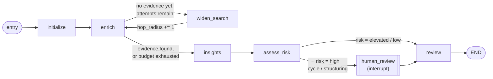

# AML Alert Triage Agent

This study project demonstrates a fictional AML alert triage workflow built with LangGraph and Neo4j. The repository includes a Docker Compose setup for running Neo4j locally so the graph-backed workflow can be exercised without manual database installation.

## Local Neo4j Setup

1. Copy `.env.example` to `.env` and adjust the password if needed.
2. Start Neo4j with Docker Compose:

```bash
docker compose up -d
```

3. Open Neo4j Browser at http://localhost:7474.
4. Use the credentials from `.env` to connect.

5. Verify application connectivity:

```bash
python -m aml_alert_triage.main --check-neo4j
```

6. Load fictional seed data:

```bash
python -m aml_alert_triage.main --seed-neo4j --seed-file data/neo4j/seed.cypher
```

## Running the Demo

The application code is organized under `src/aml_alert_triage/`. The triage workflow can run in offline mode against the bundled fictional dataset or against the Neo4j container when the driver settings are configured. Use `--alert-id` to pick which fictional scenario to triage (see [AML Typology Scenarios](#aml-typology-scenarios)) and `--use-langgraph` to run the compiled LangGraph graph instead of the plain linear call chain:

```bash
# Linear call chain (default), baseline scenario
python -m aml_alert_triage.main --prompt "Review this fictional AML alert and provide concise investigation insights."

# Compiled LangGraph graph, a circular-transfer (layering) scenario
python -m aml_alert_triage.main --use-langgraph --alert-id alert-003
```

## Triage Strategy Flow

Each triage run follows a fixed sequence of stages, regardless of whether LLM insight generation is enabled:

1. **User prompt** - the caller supplies a fictional alert and an optional free-text prompt describing what they want the analyst summary to focus on.
2. **Neo4j retrieval** - the workflow queries Neo4j (or the bundled offline fixtures when no database is reachable) for graph evidence connected to the alert's customer, and produces a deterministic evidence summary.
3. **LLM insight generation** - the alert context, user prompt, and evidence are composed into a constrained prompt and sent to the configured LLM adapter, which returns a short summary plus key observations. If the LLM is disabled, unavailable, or returns an error, the workflow falls back to safe default insight text and records the failure instead of stopping the run.
4. **Response output** - the workflow combines the evidence-backed recommendation with the LLM insights into one structured JSON response, clearly separating factual evidence statements from interpretive insights.

```
user prompt -> Neo4j retrieval -> LLM insight generation -> response output
```

## LangGraph Execution Graph

The workflow logic in `src/aml_alert_triage/workflow.py` is written as plain functions over an immutable `TriageState` dataclass, so it can run two ways: as a **linear** in-process call chain (`run_triage`, a bounded `while` loop plus a synchronous callback), or as a **compiled LangGraph `StateGraph`** (`build_langgraph`, with real conditional edges, a cycle, and a checkpointed interrupt). Both execute the same node logic and produce the same fields, but only the graph form can express branching, retries, and pausing natively:



| Node | Function | What it does |
| --- | --- | --- |
| `initialize` | `initialize_state` | Seeds `TriageState` from the alert and user prompt. |
| `enrich` | `enrich_state` | Queries Neo4j at the current `hop_radius` for connected evidence and dedicated cycle/structuring pattern matches. |
| `widen_search` | `widen_search` | **The graph's cycle.** Increments `hop_radius` when evidence so far is thinner than `min_evidence_for_conclusion` and the retry budget (`max_enrichment_attempts`, `neo4j_max_hops`) allows another attempt, then routes back to `enrich`. Bounded, so it always terminates. |
| `insights` | `generate_insights` | Sends the settled evidence to the LLM adapter for a summary and key observations (see [LLM Insight Generation](#llm-insight-generation)). |
| `assess_risk` | `assess_risk` | Classifies evidence into a risk level: `high` if a `cycle`/`structuring-fanout`/`structuring-fanin` pattern was detected, `elevated` if any other evidence exists, `low` otherwise. |
| `human_review` | interrupts via `langgraph.types.interrupt` | **Only reached for `high` risk.** Pauses the graph - genuinely, via the compiled checkpointer - and waits for an analyst decision (`confirm-escalation` / `reject-escalation`) sent back with `Command(resume=...)`. |
| `review` | `review_evidence` + `finalize_state` | Produces the final recommendation and disposition (`escalate` / `review` / `monitor`), honoring any analyst decision. |

This is the part a plain function chain can't reproduce on its own: `enrich <-> widen_search` is a real cycle, the two `route_after_*` functions are conditional edges chosen from a live risk classification, and `human_review` genuinely suspends execution mid-graph (backed by `MemorySaver`) rather than blocking a thread or requiring a callback - `run_triage`'s linear equivalent has to fake the pause with a synchronous `human_review_callback` because a straight-line function chain has nothing to pause and resume.

### Human-in-the-loop review from the CLI

```bash
# 1. Run a high-risk scenario - it pauses and prints the interrupt payload
python -m aml_alert_triage.main --use-langgraph --alert-id alert-003 --thread-id demo-1

# 2. Resume with an analyst decision, in the same process
python -m aml_alert_triage.main --use-langgraph --alert-id alert-003 --thread-id demo-1 --analyst-decision confirm-escalation
```

`--analyst-decision` can also be passed on the very first call to pause and resume in one command (useful for scripting demos). The built-in `MemorySaver` checkpointer is in-memory only, so a paused run can only be resumed within the same process - persisting checkpoints across separate CLI invocations would need a durable backend such as `langgraph-checkpoint-sqlite`.

## Transaction Graph Model

The graph models a small fictional bank's money movement, not a set of pre-labeled test cases. `Customer` nodes `OWNS` one `Account`; accounts move money to each other over a single `TRANSFERRED_TO` relationship type, distinguished by a `channel` property - `pix`, `boleto`, `ted`, or `deposit` - matching how Brazilian retail payments actually happen day to day. A `boleto` payment is still just a `TRANSFERRED_TO` edge (payer account -> billing account); it isn't a separate node type, since that would complicate every cycle/fan-out/fan-in query for no benefit to the pattern-detection logic. `Alert` nodes exist only as neutral monitoring triggers (`-[:TARGETS]->` a customer) - a threshold or rule that fired, e.g. `velocity-alert` or `manual-referral`. **Nothing in the graph states what AML typology, if any, a customer is actually involved in** - that is what the LangGraph workflow's cycle/structuring queries and the LLM insight stage exist to determine.

The dataset (`src/aml_alert_triage/graph_dataset.py` for the canonical data, `data/neo4j/seed.cypher` for the live-graph rendering of the same data) is generated once, deterministically, by a scratchpad script with a fixed random seed:

- **25 "organic" customers** with everyday PIX/boleto/TED/deposit activity between each other (~50 transactions) - generated so that money only flows in one direction along a random account ordering, which makes it structurally impossible for the random noise to contain a cycle, and each account is capped at 3 distinct counterparties, keeping it below the fan-out/fan-in detection threshold. The generator self-validates both properties before anything is written to disk.
- **4 accounts with an actual pattern injected on purpose**: a 4-hop transfer cycle, a 6-way structuring fan-out, a 5-way structuring fan-in (mule account), and a thin-file account with a single sparse transaction whose counterparty's *other* activity only surfaces once the search widens to 2 hops.
- **1 fully isolated customer** with zero transactions, to exercise the "genuinely nothing here" / retry-budget-exhausted path.

| `--alert-id` | Customer | Alert reason (given) | What the workflow actually finds |
| --- | --- | --- | --- |
| `alert-001` | cust-100 | `periodic-review` | Ordinary organic activity -> `elevated` / `review` |
| `alert-002` | cust-200 | `new-account-monitoring` | No transactions at all, even after widening -> `low` / `monitor` |
| `alert-003` | cust-300 | `large-value-transaction` | **A 4-hop directed cycle** back to the originating account -> `high` / `escalate` |
| `alert-004` | cust-400 | `velocity-alert` | **Structuring fan-out**: 6 distinct beneficiaries, each just under a reporting threshold -> `high` / `escalate` |
| `alert-005` | cust-500 | `manual-referral` | One sparse transaction; widening to 2 hops surfaces the counterparty's other activity -> `elevated` / `review` |
| `alert-006` | cust-600 | `velocity-alert` | **Structuring fan-in** (mule account): 5 distinct sources converging -> `high` / `escalate` |

Live Neo4j and offline/test mode compute this identically: cycle/structuring detection is real Cypher (`_fetch_cycle_evidence`, `_fetch_structuring_evidence` in `repository.py` - a directed variable-length path query back to the same account for cycles, a fan-out/fan-in count over `TRANSFERRED_TO` edges for structuring) when Neo4j is reachable, and a pure-Python reimplementation of the exact same traversal (`graph_engine.py`) when it isn't - not a hand-maintained set of fixtures that can silently drift from what the live queries actually compute.

## LLM Insight Generation

LLM insight generation is optional and disabled by default so the workflow runs fully offline. It is controlled with these environment variables (see `.env.example`):

| Variable | Purpose | Default |
| --- | --- | --- |
| `AML_ALERT_LLM_ENABLED` | Turns LLM insight generation on/off. | `false` |
| `AML_ALERT_LLM_PROVIDER` | `rule-based` (deterministic, offline) or `anthropic` (real Claude API call). | `rule-based` |
| `AML_ALERT_LLM_MODEL` | Model name passed to the provider. | `local-insight-summarizer` |
| `AML_ALERT_LLM_TIMEOUT_SECONDS` | Timeout applied to LLM calls. | `15` |
| `ANTHROPIC_API_KEY` | Required only when `AML_ALERT_LLM_PROVIDER=anthropic`. | unset |

**Running without an LLM (default):** leave `AML_ALERT_LLM_ENABLED=false`. The workflow still executes the insights stage, but it records a `not-requested`/fallback status and safe default text - triage always completes.

**Running with the deterministic offline provider:** set `AML_ALERT_LLM_ENABLED=true` and leave `AML_ALERT_LLM_PROVIDER=rule-based`. This exercises the full insights pipeline without any network calls or API key.

**Running with the real Claude API:**

```bash
pip install -e ".[llm]"
export AML_ALERT_LLM_ENABLED=true
export AML_ALERT_LLM_PROVIDER=anthropic
export AML_ALERT_LLM_MODEL=claude-sonnet-5
export ANTHROPIC_API_KEY=sk-ant-...
python -m aml_alert_triage.main --prompt "Focus on connected entities."
```

If the Claude API call fails or times out, the workflow catches the error, marks the insight status as `fallback`, and still returns a completed triage response with the recommendation and a safe default insight message.

## Project Scope

- All data is fictional.
- All code, comments, logs, and docs are in English.
- The repository is intended for learning and experimentation only.
