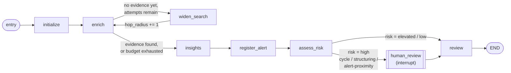

# AML Alert Triage Agent

A fictional AML (anti-money-laundering) customer-investigation workflow built with **LangGraph** + **Neo4j** + **DynamoDB**. It investigates a customer, retrieves connected evidence from a transaction graph, asks an LLM (or a deterministic rule-based fallback) to interpret that evidence, and - if warranted - writes an `Alert` back to the graph and generates a Portuguese Markdown investigation report.

This is a study project. All data is fictional; see [Project Scope](#project-scope).

**[Presentation](presentation/Deck_corporativo_de_25_slides.pdf)** (PDF, 25 slides, Portuguese) - an architecture and LangGraph walkthrough built from this repo's real output.

## Prerequisites

- Python 3.11+
- Docker + Docker Compose
- (Optional) An Anthropic or OpenAI API key, if you want real LLM-generated insights instead of the deterministic offline mode

## Quickstart

Run these in order from the repository root.

### 1. Install the project

```bash
pip install -e .
# or, to also enable the real Claude/OpenAI providers:
pip install -e ".[llm]"
```

### 2. Configure your environment

```bash
cp .env.example .env
```

Open `.env` and check the values - the defaults work out of the box for local Neo4j/DynamoDB. `.env` is loaded automatically (via `python-dotenv`) whenever you run the CLI; you don't need to `export` anything manually.

### 3. Start Neo4j and DynamoDB Local

```bash
docker compose up -d
```

This starts three containers:

| Service | URL | Purpose |
| --- | --- | --- |
| Neo4j | http://localhost:7474 (browser), `bolt://localhost:7687` | The transaction graph |
| DynamoDB Local | `http://localhost:8000` | Alert investigation snapshots |
| dynamodb-admin | http://localhost:8001 | Browse the DynamoDB table visually |

Neo4j takes ~20-30 seconds to become healthy on first start.

### 4. Verify connectivity

```bash
python -m aml_alert_triage.main --check-neo4j
python -m aml_alert_triage.main --check-dynamodb
```

Both should print `{"...": "ok", ...}`. If `--check-neo4j` fails, wait a bit longer for the container's healthcheck and try again.

### 5. Load the fictional dataset

```bash
python -m aml_alert_triage.main --seed-neo4j
python -m aml_alert_triage.main --seed-dynamodb
```

This loads 50 fictional customers/accounts/transactions into Neo4j and 2 pre-registered alert snapshots into DynamoDB. See [Transaction Graph Model](#transaction-graph-model) for what's actually in there.

### 6. Run your first investigation

```bash
python -m aml_alert_triage.main --customer-id cust-101
```

You should get back a JSON response with a `disposition` (`monitor` / `review` / `escalate`), evidence, and an LLM (or rule-based) insight. Since `cust-101` is an ordinary customer, no alert should be created.

You're set up. Jump to [Use Case Examples](#use-case-examples) for more interesting scenarios, or keep reading for how everything fits together.

## Re-running setup after a Docker reset

If you delete the Docker volumes/images (`docker compose down -v`, `docker system prune`, etc.), both databases come back empty. Just repeat steps 3-5 above - no code changes needed, and no need to manually clear anything first since you're starting from empty containers.

## Configuring the LLM (optional)

By default (`AML_ALERT_LLM_ENABLED=false`), insights are generated by a deterministic, offline, rule-based adapter - no API key, no network call, no cost. To use a real LLM instead:

```bash
# In .env:
AML_ALERT_LLM_ENABLED=true
AML_ALERT_LLM_PROVIDER=openai        # or: anthropic
AML_ALERT_LLM_MODEL=gpt-5            # or: claude-sonnet-5
OPENAI_API_KEY=sk-...                # or ANTHROPIC_API_KEY=sk-ant-...
```

| Variable | Purpose | Default |
| --- | --- | --- |
| `AML_ALERT_LLM_ENABLED` | `false` = offline rule-based insights. `true` = real LLM call. | `false` |
| `AML_ALERT_LLM_PROVIDER` | `anthropic` or `openai`. Only used when enabled. | `anthropic` |
| `AML_ALERT_LLM_MODEL` | Model name. Switch models/providers purely via `.env`, no code change. | `local-insight-summarizer` |
| `AML_ALERT_LLM_TIMEOUT_SECONDS` | HTTP timeout for the LLM call. Reasoning models can be slow - raise this (e.g. `60`) if you see `Request timed out.` errors. | `15` |
| `AML_ALERT_LLM_REASONING_EFFORT` | `low`/`medium`/`high`, forwarded to reasoning-capable OpenAI models (`o`-series, `gpt-5`). | unset (`medium` applied automatically for `openai`) |
| `ANTHROPIC_API_KEY` / `OPENAI_API_KEY` | Required only for the selected provider. | unset |

**Troubleshooting:** if `insights.status` comes back `"fallback"` instead of `"generated"`, check `insights.error` in the response - it names the actual failure (timeout, missing package, empty response, etc.), rather than failing silently.

## Use Case Examples

All examples assume the setup above is done. Swap `--customer-id` for any id from the table in [Transaction Graph Model](#transaction-graph-model).

### 1. Investigate an ordinary customer (no alert expected)

```bash
python -m aml_alert_triage.main --customer-id cust-101
```
`risk.level` should be `elevated` or `low`, `alert.action` should be `"none"`.

### 2. Investigate an undiscovered suspicious customer (creates an alert)

```bash
python -m aml_alert_triage.main --use-langgraph --customer-id cust-214
```
`cust-214` has an undiscovered structuring fan-in pattern. Expect `risk.level: "high"` and, since this is high risk, the run **pauses** for analyst review (see next example) before an alert can be confirmed as escalated - though `register_alert` already writes the `Alert` node before the pause, since alert creation is independent of the escalation decision.

### 3. Resolve a paused human-review interrupt

High-risk cases pause the LangGraph run and wait for an analyst decision:

```bash
python -m aml_alert_triage.main --use-langgraph --customer-id cust-214 --thread-id demo-1
# ... prints "paused": true and an interrupt payload ...

python -m aml_alert_triage.main --use-langgraph --customer-id cust-214 --thread-id demo-1 --analyst-decision confirm-escalation
# or: --analyst-decision reject-escalation
```
Both calls must share the same `--thread-id` and run in the same process session (the built-in checkpointer is in-memory only).

### 4. Investigate a customer connected to an already-alerted customer

```bash
python -m aml_alert_triage.main --customer-id cust-129
```
`cust-129` has no cycle/structuring pattern of its own, but is connected two hops away to `cust-200` (already alerted) - `alert-proximity` evidence should appear and risk should be `high`.

### 5. Re-run the same investigation (idempotency check)

```bash
python -m aml_alert_triage.main --customer-id cust-214
```
`alert.action` should now be `"existing"`, not `"created"` - no duplicate alert.

### 6. Generate a Portuguese investigation report

```bash
python -m aml_alert_triage.main --report-alert-id alert-auto-cust-214
```
Writes `reports/alert-auto-cust-214.md`: reason, risk assessment, the insight analysis that triggered it, an evidence table, and a ready-to-run Cypher query to visualize the case - all in Portuguese. Works for the 2 pre-registered alerts too (`alert-auto-cust-200`, `alert-auto-cust-207`), since those have seeded snapshots.

### 7. Run with a free-text prompt focus

```bash
python -m aml_alert_triage.main --customer-id cust-101 --prompt "Focus on TED transfers and repeated counterparties."
```

## How It Works

Each investigation run follows a fixed sequence of stages:

1. **User prompt** - caller supplies a customer id and an optional free-text prompt.
2. **Neo4j retrieval** - evidence enrichment: transactions (widened hop by hop), structural pattern detection (cycle, structuring fan-out/fan-in, proximity to an already-alerted customer), and any pre-existing alert for the customer.
3. **LLM insight generation** - evidence is composed into a prompt and sent to the configured adapter, which returns a summary, key observations, and a grounded recommendation on whether to raise an alert (in English, plus a Portuguese translation used only by the report).
4. **Alert registration** - idempotent: reports an existing alert unchanged, or creates a new one if recommended, persisting a snapshot to DynamoDB for later report generation.
5. **Response output** - a structured JSON response combining evidence, insight, risk, and alert outcome.

```
user prompt -> Neo4j retrieval -> LLM insight generation -> alert registration -> response output
```

### LangGraph execution graph

`--use-langgraph` runs the workflow as a compiled `StateGraph` instead of a plain linear call chain, adding a real retry cycle, conditional branching, and a genuine pause/resume interrupt:



| Node | Function | What it does |
| --- | --- | --- |
| `initialize` | `initialize_state` | Seeds `TriageState` from the customer id and user prompt. |
| `enrich` | `enrich_state` | Queries Neo4j at the current `hop_radius` for connected evidence, cycle/structuring/alert-proximity matches, and any pre-existing alert. |
| `widen_search` | `widen_search` | The retry cycle: widens `hop_radius` when evidence is too thin, bounded by `AML_ALERT_MAX_ENRICHMENT_ATTEMPTS`/`NEO4J_MAX_HOPS`. |
| `insights` | `generate_insights` | Calls the insight adapter for a summary, observations, and alert recommendation. |
| `register_alert` | `register_alert` | Idempotent Neo4j `Alert` write-back + DynamoDB snapshot persistence, independent of `assess_risk`. |
| `assess_risk` | `assess_risk` | Classifies risk (`high`/`elevated`/`low`) from evidence typologies. |
| `human_review` | `interrupt(...)` | Only reached for `high` risk. Genuinely pauses the graph until resumed with `--analyst-decision`. |
| `review` | `review_evidence` + `finalize_state` | Final recommendation and disposition. |

The linear path (`run_triage`, the default without `--use-langgraph`) executes the same node logic as a bounded `while` loop, faking the human-review pause with a synchronous callback instead of a real interrupt.

## Transaction Graph Model

The graph models people, accounts, and transactions - not pre-labeled test cases. `Customer` nodes `OWNS` one `Account`; accounts move money via `TRANSFERRED_TO` relationships (`channel`: `pix`/`boleto`/`ted`/`deposit`). `Alert` nodes are the workflow's **output**, not an input - `register_alert` creates them when insight generation concludes a customer should be flagged.

The dataset is generated deterministically and self-validated by `scripts/generate_dataset.py` (rerun it to regenerate `graph_dataset.py`, `data/neo4j/seed.cypher`, and `data/dynamodb/seed.json` identically).

**50 customers:**

| Customers | Pattern | Notes |
| --- | --- | --- |
| `cust-100` .. `cust-129` (30) | Ordinary organic activity | No cycle/structuring; `cust-100` is a thin-file case (1 transaction, exercises the widen-search retry). |
| `cust-200` .. `cust-206` (7) | Directed transfer cycle | `cust-200` has a **pre-registered alert**; the other 6 are undiscovered. |
| `cust-207` .. `cust-213` (7) | Structuring fan-out | `cust-207` has a **pre-registered alert**; the other 6 are undiscovered. |
| `cust-214` .. `cust-219` (6) | Structuring fan-in | All undiscovered. |
| `cust-129` | Alert-proximity demo | Otherwise-ordinary, but 2 hops from `cust-200` (already alerted). |

Only `cust-200` and `cust-207` start with an `Alert` already in the graph - everyone else is undiscovered until investigated. Live Neo4j and offline/test mode compute detection identically (`repository.py`'s Cypher vs. `graph_engine.py`'s pure-Python mirror), so behavior never silently drifts between the two.

### Evidence retrieval depth

`NEO4J_MAX_HOPS` bounds the general evidence-widening search (a real, iterative hop-by-hop traversal). `AML_ALERT_CYCLE_MAX_HOPS` and `AML_ALERT_PROXIMITY_MAX_HOPS` are separate, independently-tunable ceilings for cycle detection and alert-proximity detection respectively.

## Alert Investigation Reports

Whenever `register_alert` creates a new alert, it persists an immutable snapshot (evidence, risk, insight) to DynamoDB - not the live Neo4j graph - so a report always reflects "why this was flagged" at that moment, even if the graph changes later. Reports render entirely in **Portuguese** (see `--report-alert-id` in [Use Case Examples](#use-case-examples)) and include a Cypher query for visualizing the case. Report generation makes no live Neo4j or LLM calls - everything comes from the snapshot. Browse the raw DynamoDB table at http://localhost:8001.

## Verifying results directly in Neo4j

Open http://localhost:7474 and run:

```cypher
// All alerts and who they target
MATCH (a:Alert)-[:TARGETS]->(c:Customer) RETURN a.alert_id, c.customer_id, a.reason ORDER BY a.alert_id;

// Transactions behind a specific customer
MATCH (c:Customer {customer_id: 'cust-214'})-[:OWNS]->(acct:Account)-[t:TRANSFERRED_TO]-(other)
RETURN acct.account_id, type(t), t.channel, t.amount, other.account_id;

// Sanity check counts (expect 50 customers, at least 2 alerts)
MATCH (c:Customer) RETURN count(c) AS total_customers;
MATCH (a:Alert) RETURN count(a) AS total_alerts;
```

Every generated report also includes a ready-to-run visualization query for that specific case.

## Command Reference

| Command | Purpose |
| --- | --- |
| `--check-neo4j` | Verify Neo4j connectivity. |
| `--seed-neo4j [--seed-file PATH]` | Load the fictional graph into Neo4j. |
| `--check-dynamodb` | Verify DynamoDB connectivity (creates the snapshot table if missing). |
| `--seed-dynamodb [--dynamodb-seed-file PATH]` | Load the pre-registered alerts' snapshots into DynamoDB. |
| `--customer-id ID` | Which customer to investigate. Default `cust-100`. |
| `--prompt TEXT` | Free-text focus for the insight stage. |
| `--use-langgraph` | Run the compiled LangGraph graph instead of the linear call chain. |
| `--thread-id ID` | Checkpoint thread id for `--use-langgraph` (default: the customer id). |
| `--analyst-decision confirm-escalation\|reject-escalation` | Resume a paused human-review interrupt. |
| `--report-alert-id ID [--report-output PATH]` | Generate a Portuguese Markdown report from a persisted snapshot. |

## Troubleshooting

- **`ModuleNotFoundError: No module named 'aml_alert_triage'`** - the package isn't installed. Run `pip install -e .` from the repo root.
- **`.env` values seem ignored** - make sure you ran `pip install -e .` (installs `python-dotenv`), and that `.env` is in the repo root (the working directory you run the CLI from).
- **`insights.status: "fallback"` with a real LLM configured** - check `insights.error` in the response; it names the actual failure instead of failing silently. Common causes: missing/incorrect API key, `openai`/`anthropic` package not installed (`pip install -e ".[llm]"`), timeout too low for a reasoning model (raise `AML_ALERT_LLM_TIMEOUT_SECONDS`, e.g. to `60`), or an empty response from a reasoning-heavy model that exhausted its token budget on internal reasoning (the OpenAI adapter's budget is 4096 tokens, generally enough for `reasoning_effort=medium`).
- **DynamoDB Local fails to start / sqlite file errors** - the compose file runs it in `-inMemory` mode specifically to avoid this; if you changed that, switch back. In-memory means data is lost on container restart - just rerun `--seed-dynamodb`.
- **Neo4j has stale/duplicate data after changing the dataset generator** - `data/neo4j/seed.cypher` uses `MERGE`, so old and new data can coexist oddly if the schema changed. When in doubt: `docker compose down -v && docker compose up -d`, then repeat the seed steps.

## Project Scope

- All data is fictional.
- All code, comments, logs, CLI/JSON output, and this documentation are in English. The one deliberate exception is the alert investigation report (`--report-alert-id`), which renders in Portuguese by design.
- The repository is intended for learning and experimentation only.
