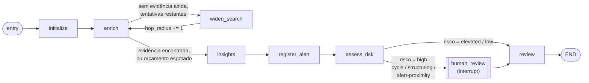

# Conteúdo para Apresentação — Triagem de Alertas AML com LangGraph + Neo4j

Este documento é o pacote de conteúdo completo para montar os slides no Claude.ai/Claude
Desktop. Público-alvo: **apresentação técnica interna (Itaú)**. Idioma dos slides: **português**.

Estrutura sugerida: **17 slides** (marcados como `[ESSENCIAL]` ou `[OPCIONAL]` — corte os
opcionais à vontade se precisar de uma versão mais curta). Cada slide traz conteúdo pronto,
referência ao arquivo de evidência (pasta `evidence/`) e, quando ajuda, uma sugestão de fala.

Todas as evidências foram geradas rodando o projeto de verdade (não são mockups): suíte de
testes, saída real de execuções via CLI com LLM real (OpenAI gpt-5) ligado, e relatórios
gerados a partir de snapshots persistidos. Os arquivos estão em `presentation/evidence/`.

---

## Slide 1 — Capa `[ESSENCIAL]`

**Título:** Triagem de Alertas AML com LangGraph + Neo4j
**Subtítulo:** Um estudo de caso: grafos de transações, agentes com estado e LLMs aplicados a
compliance
**Rodapé:** nome, data, "projeto de estudo pessoal / fictício"

---

## Slide 2 — O problema `[ESSENCIAL]`

**Conteúdo sugerido:**
- Triagem de AML (Anti-Money Laundering) hoje depende de analistas cruzando informação
  espalhada: transações, titularidade de contas, alertas já abertos para outras partes.
- O risco raramente está numa transação isolada — está no **padrão de rede**: um ciclo de
  transferências, uma pulverização de valores parecidos entre várias contas (fan-out/fan-in),
  ou a proximidade com alguém que já foi alertado.
- Dados assim são naturalmente um **grafo**, não uma tabela. E a decisão final não pode ser
  100% automática — precisa de evidência rastreável e, em casos de alto risco, confirmação
  humana.

**Fala sugerida:** "isso motivou as três escolhas de arquitetura que vamos ver a seguir: Neo4j
para o grafo, LangGraph para orquestrar decisão com estado, e um LLM para interpretar evidência
— nunca para decidir sozinho."

---

## Slide 3 — Visão geral da arquitetura `[ESSENCIAL]`

**Evidência/visual:** `evidence/00_arquitetura_geral.mmd` (diagrama Mermaid)

**Conteúdo sugerido:**
- **Neo4j** — grafo transacional (`Customer -[:OWNS]-> Account -[:TRANSFERRED_TO]-> Account`),
  fonte de verdade viva.
- **LangGraph** — orquestra o workflow de triagem como uma máquina de estados (não uma cadeia
  linear).
- **LLM plugável** — Anthropic Claude ou OpenAI GPT, trocável só via `.env`.
- **DynamoDB Local** — snapshot imutável (evidência + insight + risco) no momento em que um
  alerta é criado.
- **Relatório .md em português** — gerado só a partir do snapshot, sem nova chamada a LLM/Neo4j.
- Tudo local, via Docker Compose (`neo4j`, `dynamodb-local`, `dynamodb-admin`).

---

## Slide 4 — LangChain vs. LangGraph `[ESSENCIAL]`

**Conteúdo sugerido:**

| | LangChain | LangGraph |
|---|---|---|
| Modelo mental | *Chain* — sequência majoritariamente linear de passos (prompt → LLM → parser) | Máquina de estados / grafo dirigido explícito (nós + arestas) |
| Ciclos | Difícil de expressar nativamente | Nativo — voltar a um nó anterior até uma condição parar de valer |
| Decisão condicional em runtime | Via lógica externa ao framework | Aresta condicional de primeira classe (`add_conditional_edges`) |
| Pausar e retomar no meio da execução | Não é o caso de uso principal | Nativo, via checkpoint (`interrupt()` / `Command(resume=...)`) |
| Observabilidade do fluxo | Implícita no código | Grafo explícito, pode ser exportado/visualizado |

**Mensagem central:** LangChain resolve bem "gerar texto em sequência". LangGraph resolve
"orquestrar uma decisão com estado, que pode ciclar, desviar e pausar" — que é exatamente o
formato de um processo de triagem/compliance.

---

## Slide 5 — O grafo real deste projeto `[ESSENCIAL]`

**Evidência/visual:** diagrama do README (rótulos legíveis) + `evidence/01_langgraph_grafo_real.mmd`
(prova: gerado direto do código via `graph.get_graph().draw_mermaid()`, sem retoque manual)



**Conteúdo sugerido — 8 nós, 2 comportamentos que uma chain linear não faz:**
1. **Ciclo real:** `enrich ↔ widen_search` — evidência insuficiente amplia o raio de busca no
   Neo4j até satisfazer um mínimo ou esgotar o orçamento de tentativas.
2. **Pausa real:** `assess_risk → human_review` só é percorrido quando o risco é `high`; dentro
   de `human_review`, `interrupt()` pausa a execução de verdade, esperando decisão humana.
3. **Mesma lógica, dois motores:** o mesmo conjunto de funções de nó roda tanto como grafo real
   (`build_langgraph`, produção) quanto como cadeia linear com `while` (`run_triage`, usada nos
   testes) — a regra de negócio é testável isolada do motor de execução.

---

## Slide 6 — Modelo de dados no Neo4j `[ESSENCIAL]`

**Evidência/visual:** `evidence/02_modelo_dados_neo4j.mmd`

**Conteúdo sugerido:**
- `(:Customer)-[:OWNS]->(:Account)-[:TRANSFERRED_TO {channel, amount, currency}]->(:Account)`
- `channel` ∈ `pix` / `ted` / `boleto` / `deposit`
- `(:Alert)-[:TARGETS]->(:Customer)` — o `Alert` é **saída** do workflow, não entrada: ele só
  existe depois que a triagem concluiu que o cliente deve ser sinalizado.
- Dataset fictício: 50 clientes (30 comportamento normal, 20 distribuídos em 3 tipologias
  suspeitas), gerado deterministicamente (seed fixa) por `scripts/generate_dataset.py`, que
  **autovalida** cada caso contra os próprios detectores antes de gravar.

---

## Slide 7 — Detecção de padrões estruturais `[ESSENCIAL]`

**Conteúdo sugerido — 4 tipologias, cada uma uma consulta Cypher dedicada:**
- **`cycle`** — ciclo direcionado de transferências que volta à conta de origem.
- **`structuring-fanout`** — uma conta pulveriza valores parecidos para várias contas
  distintas (possível fracionamento).
- **`structuring-fanin`** — várias contas convergem valores parecidos para uma única conta
  (possível conta-laranja/coletora).
- **`alert-proximity`** — o cliente está conectado (até N saltos configuráveis) a outro cliente
  que **já tem um alerta** — risco por associação de rede, não pela transação em si.
- Qualquer uma dessas 4 evidências classifica o caso como risco **`high`** e aciona revisão
  humana — independente de quantas outras evidências "normais" existam.

---

## Slide 8 — Antes vs. Depois: de regra estática a raciocínio real `[ESSENCIAL — o mais forte do deck]`

**Evidência/visual:** `evidence/10_report_cust-207_fanout.md` (lado A) vs.
`evidence/11_report_cust-129_alert_proximity.md` (lado B) — comparação lado a lado

Este é o ponto de virada do projeto: a versão inicial gerava só texto determinístico
(*rule-based*); a evolução liga um LLM real (Anthropic **ou** OpenAI, à escolha do `.env`) que
lê a mesma evidência e **raciocina** sobre ela.

**Lado A — modo estático (`insight_mode: static`), alerta `alert-auto-cust-207` (fan-out):**
> "As evidências indicam atividade conectada para o cliente cust-207; a revisão do analista
> deve priorizar partes relacionadas e transações repetidas."

Texto genérico — o mesmo template se repetiria para qualquer fan-out, mudando só os números.

**Lado B — LLM real (`insight_mode: openai`, gpt-5), alerta `alert-auto-cust-129` (proximidade):**
> "Não há evidência clara de ciclagem ou fracionamento nas transações listadas; recomenda-se
> alerta com base apenas na proximidade a um cliente já alertado."

O modelo **distingue** ausência de padrão direto e ainda assim justifica o alerta pelo motivo
correto (proximidade de rede) — um raciocínio específico ao caso, não um template.

**Mensagem central:** o LLM nunca substitui a evidência estrutural (ambos os alertas só
existem porque uma consulta Cypher encontrou um padrão) — ele melhora a **interpretação e a
comunicação** dessa evidência para o analista.

---

## Slide 9 — Caso: cliente comum, o LLM decide não alertar `[OPCIONAL]`

**Evidência/visual:** `evidence/05_cli_cust-100_thin_file.log`

**Conteúdo sugerido:**
- Cliente `cust-100`: 4 transações em canais diferentes (TED, PIX, boleto), sem nenhum padrão
  estrutural.
- Risco classificado como `elevated` (há evidência conectada, mas nenhuma tipologia de alto
  risco).
- Insight real (gpt-5): *"No concrete evidence of structuring, circular flows, rapid layering,
  or proximity to alerted parties. Based solely on the provided data, no alert is
  recommended."*
- `recommend_alert: false` → nenhum alerta criado.

**Mensagem central:** o prompt instrui o modelo a só recomendar alerta com evidência concreta —
nunca por ausência de informação ou especulação. Aqui ele segue essa instrução mesmo tendo
"algo" para comentar.

---

## Slide 10 — Caso: ciclo detectado + idempotência `[OPCIONAL]`

**Evidência/visual:** `evidence/06_cli_cust-200_cycle.log`

**Conteúdo sugerido:**
- Cliente `cust-200`: ciclo direcionado de 3 saltos que retorna à conta de origem → risco
  `high`, tipologia `cycle`.
- Esse cliente **já tinha** um alerta pré-registrado (`alert-auto-cust-200`).
- `register_alert` é idempotente: encontra o alerta existente e **não duplica** —
  `"alert": {"action": "existing", "alert_id": "alert-auto-cust-200", ...}`.
- Insight real (gpt-5) já incorpora esse fato: *"An existing alert for this cycle already
  exists; no new alert recommended."*

---

## Slide 11 — Caso: risco por proximidade de rede `[ESSENCIAL]`

**Evidência/visual:** `evidence/07_cli_cust-129_alert_proximity.log` +
`evidence/11_report_cust-129_alert_proximity.md`

**Conteúdo sugerido:**
- Cliente `cust-129` não tem, sozinho, nenhum padrão de ciclo/estruturação.
- Está conectado — via uma conta-ponte, em 2 saltos — a `cust-200`, que **já tem alerta**.
- Isso sozinho já é `HIGH_RISK_EVIDENCE_KIND` (`alert-proximity`) → risco `high` →
  `recommend_alert: true` → um **novo** alerta é criado (`alert-auto-cust-129`).
- Ilustra "contágio de risco por rede": estar perto de alguém já alertado é, por si, motivo de
  atenção — mesmo com comportamento individual aparentemente normal.
- O número de saltos considerado é configurável (`AML_ALERT_PROXIMITY_MAX_HOPS`), não fixo em
  código.

---

## Slide 12 — Human-in-the-loop de verdade: pausa e retomada `[ESSENCIAL]`

**Evidência/visual:** `evidence/08_cli_cust-214_human_review_pause.log` (pausa) +
`evidence/08b_cli_cust-214_human_review_resumed.log` (retomada)

**Conteúdo sugerido:**
- Cliente `cust-214`: padrão `structuring-fanin` (5 PIX de contas diferentes, valores
  parecidos, convergindo para a mesma conta) → risco `high`.
- O grafo **realmente pausa** dentro do nó `human_review` (`interrupt()`), devolvendo o
  controle do processo com um payload explicando o motivo — sem terminar a execução:
  ```json
  {
    "paused": true,
    "thread_id": "cust-214",
    "interrupt": [{ "reason": "High-risk AML structural pattern detected; analyst
       confirmation is required.", "typologies": ["structuring-fanin"], ... }]
  }
  ```
- Retomando com `--analyst-decision confirm-escalation`, a execução **continua exatamente de
  onde parou** (não reprocessa evidência nem chama o LLM de novo) e conclui:
  `"disposition": "escalate"`, com `workflow_steps` mostrando `analyst-reviewed` no meio do
  caminho.
- Isso é sustentado por um checkpointer (`MemorySaver`) — em produção seria trocado por um
  checkpointer durável (ex. banco), para resistir a reinício de processo.

**Fala sugerida:** "isso é o requisito de compliance mais importante do projeto: um alerta de
alto risco nunca é criado ou fechado sem confirmação humana explícita, e o sistema é capaz de
esperar essa confirmação sem perder o estado da investigação."

---

## Slide 13 — Multi-provedor e bilíngue, tudo via `.env` `[OPCIONAL]`

**Conteúdo sugerido:**
- Trocar de Anthropic Claude para OpenAI GPT (ou vice-versa) é **só variável de ambiente** —
  `AML_ALERT_LLM_PROVIDER=openai|anthropic`, `AML_ALERT_LLM_MODEL=...` — sem alterar código.
- Suporte a `reasoning_effort` (modelos O-series/gpt-5 da OpenAI) para raciocínio mais
  aprofundado antes de responder.
- Uma única chamada ao modelo já retorna **duas versões** da mesma resposta: campos em inglês
  (fonte de verdade — usados no JSON da CLI e gravados no Neo4j) e campos `_pt` em português
  (usados só no relatório) — sem custo/chamada extra.
- Contrato de resposta é um schema JSON estruturado (`INSIGHT_RESPONSE_SCHEMA`), não texto
  livre — isso é o que permite tratar a saída do LLM como dado confiável no resto do pipeline.

---

## Slide 14 — Persistência imutável + relatório em português `[ESSENCIAL]`

**Evidência/visual:** `evidence/09_report_cust-214_fanin_real_llm.md` (abrir e mostrar
renderizado)

**Conteúdo sugerido:**
- No momento em que um alerta é criado, um **snapshot imutável** (evidência + risco + insight)
  é salvo no DynamoDB — separado do Neo4j, que continua vivo e mutável.
- O relatório (`--report-alert-id`) lê **só** esse snapshot: nenhuma chamada nova a LLM ou
  Neo4j — reprodutível e auditável, não sujeito a re-triagem/drift.
- Sai inteiramente em português, incluindo uma consulta Cypher pronta para colar no Neo4j
  Browser e visualizar o caso:
  ```cypher
  MATCH (c:Customer {customer_id: 'cust-214'})-[:OWNS]->(acct)-[t:TRANSFERRED_TO*1..3]-(other)
  RETURN c, acct, t, other;
  ```
- Falha ao salvar o snapshot não derruba a investigação (best-effort, logada) — só a geração de
  relatório falha depois, de forma clara.

---

## Slide 15 — Qualidade: testes e paridade offline/live `[OPCIONAL]`

**Evidência/visual:** `evidence/03_testes_pytest.txt` + `evidence/04_dataset_generation.txt`

**Conteúdo sugerido:**
- **97/97 testes passando** (`pytest`, exit code 0) — cobrindo workflow linear, workflow
  LangGraph, repositório Neo4j, adaptadores de LLM, tradução pt-BR e snapshot store.
- `graph_engine.py` (motor Python puro/offline) espelha exatamente as mesmas consultas Cypher
  de `repository.py` — testes não fazem I/O de rede e nunca divergem do comportamento real.
- O dataset é gerado por script determinístico (seed fixa) que **se autovalida** contra os
  próprios detectores antes de escrever qualquer arquivo — reexecutá-lo é idempotente (50
  clientes, 145 contas, 163 transações, sempre os mesmos).

---

## Slide 16 — Limitações conscientes e próximos passos `[ESSENCIAL — mostra maturidade técnica]`

**Conteúdo sugerido (trade-offs assumidos deliberadamente, não bugs):**
- **DynamoDB Local em modo `-inMemory`**: evita um bug de permissão de arquivo sqlite com
  volumes nomeados no Docker Desktop/Windows — mas perde dados ao reiniciar o container
  (mitigado com `--seed-dynamodb`).
- **Checkpointer do LangGraph em memória (`MemorySaver`)**: retomar uma pausa só funciona
  dentro do mesmo processo/execução — um checkpointer durável seria necessário para retomar
  entre invocações separadas da CLI.
- **Observado ao vivo:** avisos de depreciação do LangGraph ao desserializar dataclasses
  próprias do checkpoint (`Deserializing unregistered type ...EvidenceItem`) — não quebra nada
  hoje, mas é um ponto de atenção para uma versão futura do LangGraph.
- **Dataset fictício**, propositalmente pequeno e sintético — não é um substituto para dados
  reais de produção nem para os controles de compliance existentes.
- **Próximos passos possíveis:** checkpointer durável (Postgres/Sqlite), mais tipologias de
  detecção, comparação sistemática de custo/qualidade entre provedores de LLM.

---

## Slide 17 — Encerramento `[ESSENCIAL]`

**Conteúdo sugerido:**
- Recapitular em 1 frase: "grafo para modelar a rede, LangGraph para orquestrar a decisão com
  estado e pausa real, LLM para interpretar evidência sem nunca substituí-la."
- Link/caminho do repositório (se for compartilhar).
- Perguntas.

---

## O que ainda falta você gerar (não dá para automatizar do terminal)

Eu gerei tudo que dá para gerar via CLI/código. Faltam capturas de tela de UI — leva 2 minutos:

1. **Screenshot do Neo4j Browser** (slide 6 ou 14): com os containers já rodando, abra
   http://localhost:7474 (usuário `neo4j`, senha `test-password`), cole a consulta Cypher do
   slide 14 (ou a de `evidence/09_report_cust-214_fanin_real_llm.md`) e rode. O Neo4j Browser
   desenha o grafo automaticamente — dá um visual bem mais forte que o diagrama Mermaid para
   esse slide específico.
2. **Screenshot do dynamodb-admin** (slide 3 ou 14): abra http://localhost:8001, mostrando a
   tabela `aml-alert-snapshots` com os snapshots persistidos (incluindo `alert-auto-cust-129`,
   criado agora mesmo pela investigação real).
3. **(Opcional) Um segundo exemplo de LLM real com o outro provedor**: hoje todas as evidências
   de LLM real usam OpenAI (é o que está ligado no seu `.env`). Se quiser mostrar Anthropic
   também rodando, troque temporariamente `AML_ALERT_LLM_PROVIDER=anthropic` no `.env` e rode
   você mesmo, por exemplo:
   ```
   PYTHONPATH=src python -m aml_alert_triage.main --customer-id cust-207
   ```
   (esse comando cria um alerta de verdade se ainda não existir um — troque `cust-207` por
   outro `cust-1xx` "comum" se preferir só ver o insight sem criar alerta). Me manda a saída
   que eu incorporo no pacote de conteúdo.

---

## Como entregar isso ao Claude.ai/Claude Desktop para montar o PowerPoint

1. Abra uma conversa nova no Claude.ai (ou no app Claude Desktop) — a geração de arquivos
   `.pptx` é um recurso nativo do produto, não precisa de nenhum plugin.
2. Anexe estes arquivos à mensagem:
   - Este arquivo (`presentation/CONTEUDO_APRESENTACAO.md`) — o roteiro completo.
   - Os diagramas: `evidence/00_arquitetura_geral.mmd`, `evidence/01_langgraph_grafo_real.mmd`,
     `evidence/02_modelo_dados_neo4j.mmd`.
   - Os 3 relatórios: `evidence/09_*.md`, `evidence/10_*.md`, `evidence/11_*.md`.
   - Os logs de CLI que quiser citar (`evidence/05_*` a `evidence/08b_*`).
   - As 2 screenshots que você vai tirar (Neo4j Browser, dynamodb-admin).
3. Peça algo como:
   > "Crie uma apresentação em PowerPoint em português a partir do roteiro anexo
   > (CONTEUDO_APRESENTACAO.md). Siga a estrutura de slides já definida no documento (posso
   > cortar os marcados como [OPCIONAL] se a apresentação ficar longa). Para os slides com
   > diagramas Mermaid, recrie o diagrama como um fluxograma nativo do PowerPoint (formas +
   > setas), não como imagem de código. Para os slides de caso de uso, use os trechos citados
   > como blocos de destaque/quote. Público: apresentação técnica interna, tom direto e
   > objetivo."
4. Revise o rascunho e peça ajustes iterativamente (tom, densidade de texto por slide, ordem)
   — é mais rápido refinar em cima de um rascunho do que descrever tudo de uma vez.

**Por que não gerar o `.pptx` direto por aqui:** o Claude.ai tem um recurso dedicado e já
ajustado para produzir arquivos do Office bem formatados (temas, layout, hierarquia visual); um
script Python (`python-pptx`) rodado no terminal produziria slides funcionais mas
visualmente mais crus. Como o roteiro acima já faz o trabalho pesado de conteúdo, o Claude.ai
consegue focar só em design.
